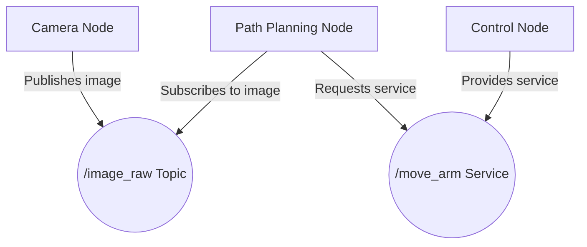

# Lesson 1: Nodes, Topics, and Services

In ROS 2, a robot's software is organized into **Nodes**. A node is a process that performs a specific task. For example, you might have a node for controlling the wheels, a node for processing camera data, and a node for planning a path.

Nodes communicate with each other by publishing and subscribing to **Topics**. A topic is a named bus over which nodes can exchange messages. For example, the camera node might publish images to an `/image_raw` topic, and the path planning node might subscribe to these images.

When a node needs to request a specific action from another node, it uses a **Service**. A service has a request and a response. For example, a node might request a service to move the robot's arm to a specific position.

Here is a diagram illustrating the relationship between nodes, topics, and services:

